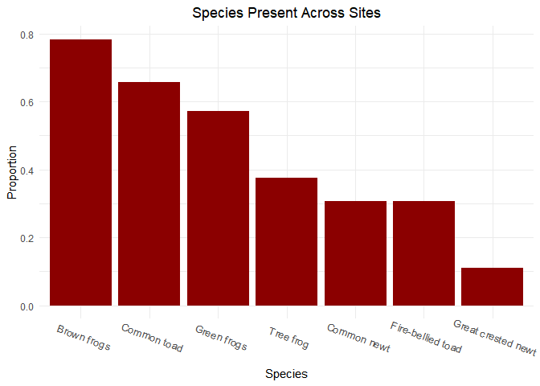
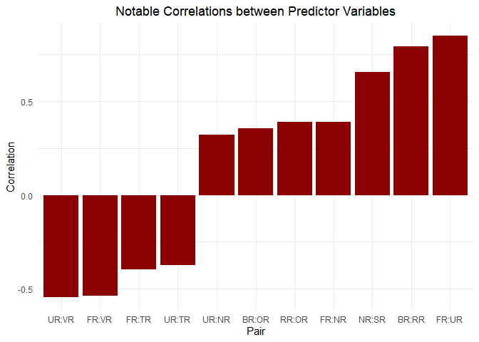
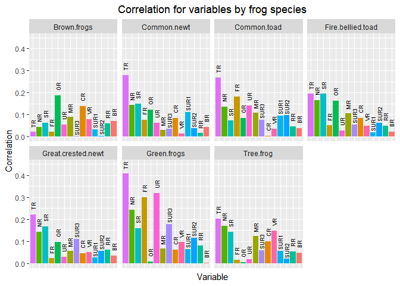
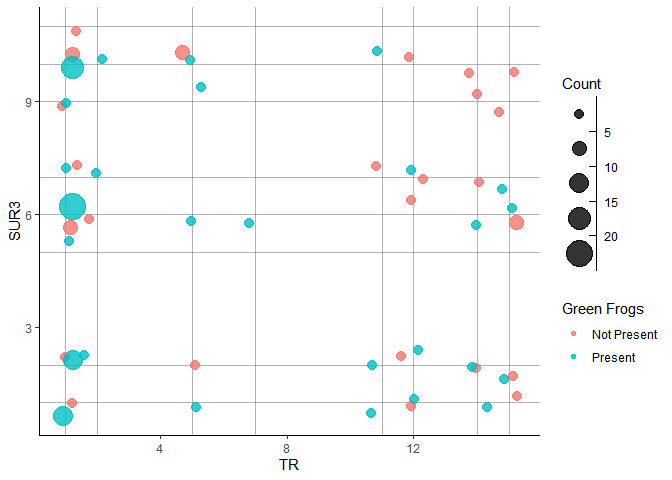
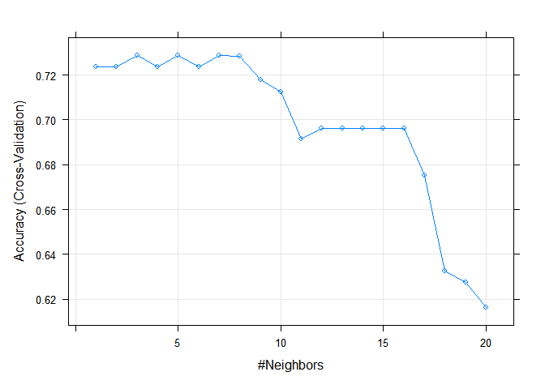

Using Logistic Regression and KNN to Predict Green Frogs’ Presence in
Reservoirs
================
Crista Gregg
3/7/2021

-   [Introduction](#introduction)
-   [Exploratory Data Analysis](#exploratory-data-analysis)
-   [Fitting a Logistic Regression
    Model](#fitting-a-logistic-regression-model)
-   [Creating a Classifier](#creating-a-classifier)
-   [Using Cross Validation](#using-cross-validation)
-   [Conclusion](#conclusion)
-   [Appendix: R Code](#appendix-r-code)

# Introduction

The goal of this analysis is to predict the presence of amphibian
species near water reservoirs based on various features. More
information about the dataset used is provided
[here]('http://archive.ics.uci.edu/ml/datasets/Amphibians'). First, I
will explore the data and look for data issues and obvious correlations.
I will then fit a logistic regression model. Finally, I will build a
predictive model to determine if site is like to have a frog species or
not, and minimize the error rate with cross validation.

# Exploratory Data Analysis

Before attempting to fit a model, I will briefly explain the variables,
check to ensure the data makes sense given the information we have about
the variables, check if there are high correlations between the
predictor variables, and then determine which frog type may be the most
interesting to study.

In this dataset, we have several types of variables indicating the
presence of certain types of frogs and newts, as well as status of the
reservoirs. For the categorical predictor variables, each number
represents the different level of a site’s feature. These are in an
intuitive order for this dataset. For example, VR is 0 for no
vegetation, 1 for light vegetation, up to 5 for completely overgrown
vegetation. However, the categorical variables don’t necessarily
increment by one. We also have two ordinal variables, RR and BR. The
last 6 variables in the dataset indicate the presence of that species,
with 1 indicating the species is present and 0 indicating that it is not
present. ID and Motorway are not included in the analysis. Listed below
are the variables present in the dataset.

    ##  [1] "ID"                 "Motorway"           "SR"                 "NR"                
    ##  [5] "TR"                 "VR"                 "SUR1"               "SUR2"              
    ##  [9] "SUR3"               "UR"                 "FR"                 "OR"                
    ## [13] "RR"                 "BR"                 "MR"                 "CR"                
    ## [17] "Green frogs"        "Brown frogs"        "Common toad"        "Fire-bellied toad" 
    ## [21] "Tree frog"          "Common newt"        "Great crested newt"

To ensure that the variables make sense, I reviewed the unique levels of
the predictor variables as compared to the levels of described in the
metadata. A concern to be noted is that FR has 5 levels in the dataset,
but the notes tell us there are only 3. To review this further I will
check how often these values show up:

    ## Frequency of Levels
    ##   0   1   2   3   4 
    ## 125  16  15  18  15

All of the 5 levels show up too many times for me to assume that there
was a mistyped number, so I will proceed with the analysis with all 5
levels as if they were meant to be included, since I have no further
information on the variable.

Looking at the means of the species’ indicator variables shows us how
often each type of frog shows up across all the sites. Brown frogs are
the most common, showing up in 78% of the sites, and Great crested newt
shows up the least, in 11% of sites.

<!-- -->

Before attempting to fit a linear model, it is important to explore
correlations between the predictors and responses. Plotted below is the
predictor pairs that have a moderate correlation (greater than the
absolute value of 3). We should keep these values in mind as we begin to
fit our analysis, as high predictor correlation can cause
multicollinearity.

<!-- -->

We can also use correlations to get an idea of which species type has
some of the strongest correlations with the predictors.

<!-- -->

Green frogs appear to have more and stronger correlations with the
variables, so I will focus my model on them for the rest of the
analysis. The strongest linear correlations are with TR, FR, UR, and NR.
We should note before proceeding that all pairs of these variables are
moderately to strongly correlated, so these may not all be present in
our final model.

# Fitting a Logistic Regression Model

Before fitting a logistic regression model, I will reduce the original
dataset to just the relevant variables and change the unordered
categorical variables to factors. I will treat the ordinal variables as
numeric, as well as the categorical variables that have an order that
makes sense, as it is easier to model as numeric variables and I want to
maintain the ordering. VR, for example, has increasing vegetation as the
level increases. Other variables I will leave as numeric are UR, FR, and
MR.

    ## 
    ## Call:
    ## glm(formula = `Green frogs` ~ ., family = binomial, data = amphib_reduced)
    ## 
    ## Deviance Residuals: 
    ##      Min        1Q    Median        3Q       Max  
    ## -2.52544  -0.66459   0.06323   0.70256   2.40803  
    ## 
    ## Coefficients:
    ##               Estimate Std. Error z value Pr(>|z|)  
    ## (Intercept) -1.368e+00  1.938e+00  -0.706   0.4803  
    ## SR           1.108e-04  7.339e-05   1.510   0.1310  
    ## NR           3.781e-01  2.975e-01   1.271   0.2038  
    ## TR2         -2.679e-01  1.474e+00  -0.182   0.8557  
    ## TR5         -2.076e+00  9.960e-01  -2.084   0.0372 *
    ## TR7          1.785e+01  3.956e+03   0.005   0.9964  
    ## TR11         2.246e-01  1.521e+00   0.148   0.8826  
    ## TR12        -1.857e+00  7.770e-01  -2.390   0.0168 *
    ## TR14        -1.264e+00  9.945e-01  -1.271   0.2036  
    ## TR15        -2.042e+00  8.785e-01  -2.324   0.0201 *
    ## VR           7.210e-02  2.601e-01   0.277   0.7816  
    ## SUR12       -5.101e-02  6.555e-01  -0.078   0.9380  
    ## SUR14        1.503e+01  3.956e+03   0.004   0.9970  
    ## SUR16        1.532e+00  1.124e+00   1.363   0.1729  
    ## SUR17        1.172e+00  9.211e-01   1.273   0.2031  
    ## SUR19        2.602e+00  1.683e+00   1.546   0.1221  
    ## SUR110       3.675e-01  7.453e-01   0.493   0.6219  
    ## SUR114       1.889e+01  3.956e+03   0.005   0.9962  
    ## SUR22       -1.029e+00  6.741e-01  -1.527   0.1269  
    ## SUR26        5.771e-01  7.488e-01   0.771   0.4409  
    ## SUR27        2.793e-01  8.110e-01   0.344   0.7305  
    ## SUR29        7.107e-01  1.347e+00   0.528   0.5977  
    ## SUR210       1.570e-01  6.560e-01   0.239   0.8108  
    ## SUR211      -1.511e+01  3.956e+03  -0.004   0.9970  
    ## SUR32       -7.544e-01  8.288e-01  -0.910   0.3627  
    ## SUR35        3.129e+01  3.096e+03   0.010   0.9919  
    ## SUR36       -8.009e-01  7.759e-01  -1.032   0.3020  
    ## SUR37       -1.907e+00  9.459e-01  -2.016   0.0438 *
    ## SUR39       -8.818e-01  1.074e+00  -0.821   0.4114  
    ## SUR310      -1.573e+00  7.281e-01  -2.161   0.0307 *
    ## SUR311      -2.059e+01  3.956e+03  -0.005   0.9958  
    ## UR           6.012e-01  3.549e-01   1.694   0.0903 .
    ## FR          -1.510e-02  3.339e-01  -0.045   0.9639  
    ## OR           1.199e-02  1.541e-02   0.778   0.4365  
    ## RR           3.215e-01  1.659e-01   1.937   0.0527 .
    ## BR          -1.175e-01  1.637e-01  -0.718   0.4727  
    ## MR           9.492e-01  6.998e-01   1.356   0.1750  
    ## CR2         -1.628e+01  1.992e+03  -0.008   0.9935  
    ## ---
    ## Signif. codes:  0 '***' 0.001 '**' 0.01 '*' 0.05 '.' 0.1 ' ' 1
    ## 
    ## (Dispersion parameter for binomial family taken to be 1)
    ## 
    ##     Null deviance: 258.14  on 188  degrees of freedom
    ## Residual deviance: 157.91  on 151  degrees of freedom
    ## AIC: 233.91
    ## 
    ## Number of Fisher Scoring iterations: 16

Starting with a fit of all the predictors at once shows that only TR and
SUR3 are significant at the 0.05 level. However, taking into
consideration the highly correlated predictors that we saw earlier, I
will attempt to avoid collinearity by removing the variable that has the
lower significance from each of these pairs. I will then utilize the
backward elimination method to remove the remaining predictors that are
not significant one at a time. This leaves us with 5 predictors- TR,
SUR3, RR, SR, and VR- that are significant at the 0.10 level.

    ##                  Estimate   Std. Error      z value     Pr(>|z|)
    ## (Intercept)  1.630763e+00 7.341098e-01  2.221415335 0.0263228433
    ## TR2         -1.976213e-01 1.228434e+00 -0.160872503 0.8721938194
    ## TR5         -1.300084e+00 7.122946e-01 -1.825205467 0.0679700291
    ## TR7          1.554204e+01 2.399545e+03  0.006477080 0.9948320741
    ## TR11         1.295146e-01 1.449760e+00  0.089335176 0.9288155396
    ## TR12        -1.933232e+00 6.821551e-01 -2.834006189 0.0045968442
    ## TR14        -1.209228e+00 7.550560e-01 -1.601507591 0.1092645402
    ## TR15        -2.765599e+00 7.401360e-01 -3.736609127 0.0001865185
    ## SUR32       -3.143748e-01 6.898490e-01 -0.455715329 0.6485946976
    ## SUR35        1.502252e+01 1.620060e+03  0.009272818 0.9926014675
    ## SUR36       -6.687176e-01 6.397587e-01 -1.045265309 0.2959003664
    ## SUR37       -1.603164e+00 8.165787e-01 -1.963269682 0.0496148464
    ## SUR39       -1.217850e+00 9.288639e-01 -1.311117306 0.1898181346
    ## SUR310      -1.444209e+00 6.444842e-01 -2.240875535 0.0250341384
    ## SUR311      -1.806602e+01 2.399545e+03 -0.007528936 0.9939928346
    ## RR           1.692184e-01 8.791177e-02  1.924866784 0.0542460264
    ## SR           1.289239e-04 6.517843e-05  1.978014515 0.0479270692
    ## VR          -3.086877e-01 1.767507e-01 -1.746458007 0.0807313980

# Creating a Classifier

We now want to use the best model to create a classifier to predict
whether a site is likely to host the green frogs. We will evaluate
several models to determine which has the best fit. I expect that a
logistic regression or LDA would give a good fit, because it is likely
to be a linear fit. If a frog dislikes to avoid a feature, chances are
that if there is more of that feature, the frog will avoid it more, and
if there is less, it will avoid it less. As an example, below is a chart
of the frogs’ presence at the levels of our two strongest predictors, TR
and SUR3. We can see that as we increase the TR, the number of sites
that host green frogs decreases steadily. The same is true as we
increase SUR3. This could indicate a linear relationship between these
predictors and the frog presence. I will also evaluate the KNN model
since the TR variable does not have an inherent ordering.

<!-- -->

Now I will split the data to compare Logistic Regression and KNN. When
using logistic regression, I will predict the site is a good habitat if
the probability of the green being present is greater than 0.5. Because
TR7 only shows up once in the dataset, it will be removed from the
classifier.

|             | Not Present | Present |
|:------------|------------:|--------:|
| Not Present |           5 |       3 |
| Present     |          13 |      26 |

The model predicted the presence of frogs 0.66 of the time correctly.
The sensitivity is 76% and the specificity is 56%.

We will now try KNN, but we must keep in mind the Curse of
Dimensionality, which will cause the fit to have a higher error rate as
we add more dimensions. With this in mind, I will use the variable that
had the highest significance in the logistic regression model: TR.

|             | Not Present | Present |
|:------------|------------:|--------:|
| Not Present |           9 |       5 |
| Present     |           9 |      24 |

We got a 0.7 accuracy rate, which is a little bit higher than the
logistic regression.

# Using Cross Validation

To attempt to increase our accuracy with the KNN model, I will use
10-fold Cross Validation to determine the best value of k. Below is a
plot of the k vs the accuracy rate, which shows us that the optimal
number of neighbors is 7. We achieved the highest accuracy rate of 72.9%
with k=7.

<!-- -->

    ## k-Nearest Neighbors 
    ## 
    ## 188 samples
    ##   1 predictor
    ##   2 classes: 'Not Present', 'Present' 
    ## 
    ## No pre-processing
    ## Resampling: Cross-Validated (10 fold) 
    ## Summary of sample sizes: 169, 170, 170, 169, 169, 169, ... 
    ## Resampling results across tuning parameters:
    ## 
    ##   k   Accuracy   Kappa    
    ##    1  0.7235088  0.4221659
    ##    2  0.7235088  0.4221659
    ##    3  0.7287719  0.4335362
    ##    4  0.7235088  0.4221659
    ##    5  0.7287719  0.4335362
    ##    6  0.7235088  0.4221659
    ##    7  0.7287719  0.4335362
    ##    8  0.7284795  0.4263712
    ##    9  0.7179532  0.4032221
    ##   10  0.7123977  0.3866626
    ##   11  0.6913450  0.3335520
    ##   12  0.6963450  0.3411285
    ##   13  0.6963450  0.3411285
    ##   14  0.6963450  0.3411285
    ##   15  0.6963450  0.3411285
    ##   16  0.6963450  0.3411285
    ##   17  0.6752924  0.2854686
    ##   18  0.6326023  0.1802868
    ##   19  0.6273099  0.1660298
    ##   20  0.6161988  0.1224483
    ## 
    ## Accuracy was used to select the optimal model using the largest value.
    ## The final value used for the model was k = 7.

Now we will perform cross validation on the logistic regression model
and compare results.

    ## Generalized Linear Model 
    ## 
    ## 188 samples
    ##   5 predictor
    ##   2 classes: 'Not Present', 'Present' 
    ## 
    ## No pre-processing
    ## Resampling: Cross-Validated (10 fold) 
    ## Summary of sample sizes: 169, 169, 170, 169, 169, 170, ... 
    ## Resampling results:
    ## 
    ##   Accuracy   Kappa    
    ##   0.7387427  0.4559573

We received an accuracy of 73.9%, marginally better than the KNN model.

# Conclusion

Overall, as expected due to the types of data we were looking at, the
best accuracy was achieved using the logistic regression model with 5
predictors: TR, SUR3, RR, SR, and VR. These predictors work well as they
do not suffer from multicollinearity and have linear trends. Because we
would expect frogs to show up in areas where there are more and more of
the features they like, it makes sense that the logistic regression
would work well using these predictors.

However, KNN also worked almost as well, using one predictor, TR. This
predictor doesn’t appear to have any inherent ordering, but is highly
significant in predicting whether the frog would be present in the site.
Therefore, a more flexible model also worked very well in predicting the
frogs’ presence. In further analysis, we could improve this model by
incorporating a dimension reduction technique such as Principle
Components Analysis, which would keep the information from more
predictors without negatively impacting our model due to a high
dimensionality.

# Appendix: R Code

``` r
library(tidyverse)
library(boot)
library(MASS)
library(class)
library(caret)
library(boot)
library(faraway)
set.seed(1)
amphib <- read_delim('http://archive.ics.uci.edu/ml/machine-learning-databases/00528/dataset.csv',delim=';',skip=1)
str(amphib)
summary(amphib[,3:23])
names(amphib)
apply(amphib[,4:23],2,unique)
table(amphib$FR,dnn='Frequency of Levels')
means<-amphib[17:23] %>%
  summarise_all(mean) %>%
  pivot_longer(cols=1:7,names_to = 'Species',values_to = 'Mean')

ggplot(data=means,aes(x=reorder(Species,-Mean),y=Mean)) + 
  geom_bar(stat='identity',fill='dark red') +
  labs(title='Species Present Across Sites',x='Species', y='Proportion') +
  theme_minimal() +
  theme(axis.text.x = element_text(angle = -20, vjust = -.5, size = 10), plot.title = element_text(hjust = 0.5))
corr<-round(cor(amphib[,c(3:23)]),4)
corr<-data.frame(corr,Variable = row.names(corr))
c<-corr[1:14,c(1:14,22)] %>%
  pivot_longer(cols = 1:14,names_to = 'var2', values_to = 'corr') %>% 
  filter(duplicated(corr)==TRUE) %>%
  filter(Variable!=var2, abs(corr) > 0.3) %>%
  mutate(Pair=paste(Variable,var2,sep=':'))
ggplot(data = unique(c), aes(x=reorder(Pair,corr),y=corr)) + 
  geom_bar(stat='identity',fill='darkred') +
  theme_minimal() +
  theme(plot.title = element_text(hjust = 0.5)) +
  labs(title='Notable Correlations between Predictor Variables', y ='Correlation', x = 'Pair')
frog_corrs<-corr[1:14,15:22]%>%
  pivot_longer(cols=1:7,names_to = 'Species',values_to = 'Correlation')

ggplot(data =frog_corrs,aes(x=reorder(Variable,-abs(Correlation)),y=abs(Correlation),fill=Variable))+
  geom_bar(stat='identity')+
  geom_text(aes(label=Variable), 
            nudge_y = .04, 
            nudge_x = -0.05, 
            size = 2.3, 
            angle = 90) +
  facet_wrap(~Species,nrow=2)+
  labs(title='Correlation for variables by frog species',
       x='Variable',
       y='Correlation') +
  theme(axis.ticks.x = element_blank(),
        axis.text.x = element_blank(),
        plot.title = element_text(hjust = 0.5),
        legend.position = "none")
amphib_reduced<-amphib[,c(3:17)] %>%
  mutate(`Green frogs`=factor(`Green frogs`, labels=c('Not Present', 'Present')),
         TR=factor(TR),
         SUR1=factor(SUR1),
         SUR2=factor(SUR2),
         SUR3=factor(SUR3),
         CR=factor(CR))
#str(amphib_reduced)
logreg<-glm(`Green frogs`~.,data=amphib_reduced,family = binomial)
summary(logreg)
logreg<-glm(`Green frogs`~.-FR-BR-NR-SUR1-SUR2-UR-OR-CR-MR,data=amphib_reduced,family = binomial) #removing one at a time
summary(logreg)
logreg<-glm(`Green frogs`~TR+SUR3+RR+SR+VR,data=amphib_reduced,family=binomial)
summary(logreg)$coef
ggplot(data=amphib[,c(3:17)],aes(x=TR,y=SUR3)) + 
  geom_vline(xintercept=c(1,5,12,14,15,11,2,7), alpha = 0.3) +
  geom_hline(yintercept=c(10,2,6,9,1,7,11,5), alpha = 0.3) +
  geom_count(aes(x=TR,y=SUR3, color=factor(`Green frogs`)), position='jitter', alpha=0.8) +
  scale_size_binned_area(breaks=c(5,10,15,20),max_size = 10, name='Count') +
  scale_color_discrete(name='Green Frogs',labels=c('Not Present','Present')) +
  theme_classic()
set.seed(1)
amphib_reduced<-filter(amphib_reduced,TR!=7)
n<-nrow(amphib_reduced)
train<-sample(n,3/4*n)
test<-amphib_reduced[-train,]
logreg_val<-glm(`Green frogs`~TR+SUR3+RR+SR+VR,data=amphib_reduced,family = binomial,subset = train)
glm.pred <- ifelse(predict(logreg_val,amphib_reduced,type='response')[-train]>0.3,'Present','Not Present')
acc1 <- round(mean(glm.pred==amphib_reduced$`Green frogs`[-train]),2)
t <- table(glm.pred,amphib_reduced$`Green frogs`[-train])
knitr::kable(t)
train.X=amphib_reduced[train,'TR']
test.X=amphib_reduced[-train,'TR']
train.P=amphib_reduced$`Green frogs`[train]
knn1<-knn(train.X,test.X,train.P,k=1)
t <- table(knn1,test$`Green frogs`)
knitr::kable(t)
acc <- round(mean(knn1==test$`Green frogs`),2)
train.control <- trainControl(method  = "cv", number = 10)

fit <- train(`Green frogs`~ TR,
             method     = "knn",
             tuneGrid   = expand.grid(k = 1:20),
             trControl  = train.control,
             metric     = "Accuracy",
             data       = amphib_reduced)
plot(fit)
fit
train.control <- trainControl(method  = "cv", number = 10)

fit <- train(`Green frogs`~ TR+SUR3+RR+SR+VR,
             method     = "glm",
             family     = binomial,
             trControl  = train.control,
             metric     = "Accuracy",
             data       = amphib_reduced)
fit
```
